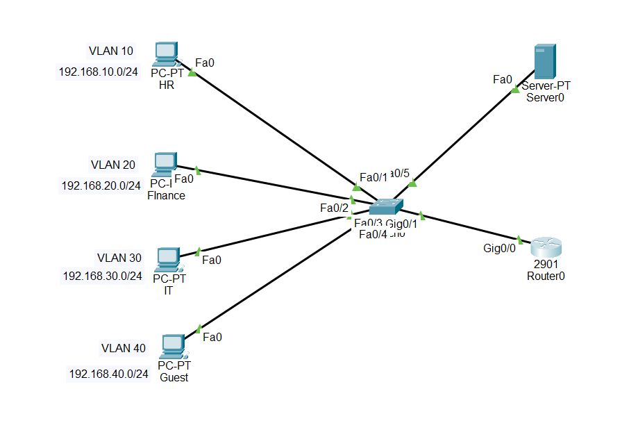
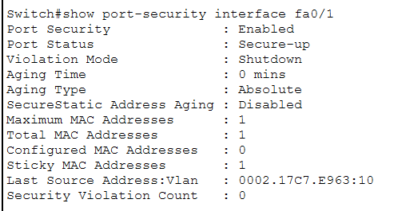

# Secure Enterprise Network (VLAN Segmentation + ACL + Port Security)

## Overview
This project simulates a segmented enterprise network built in Cisco Packet Tracer. It demonstrates practical implementation of VLAN segmentation, inter-VLAN routing (Router-on-a-Stick), least-privilege access control using ACLs, and Layer 2 port security to prevent unauthorized device access.

The goal was to design a network the way a real organization would — isolating departments, restricting sensitive traffic, and hardening access points — combining CCNA-level networking fundamentals with a security-first mindset.

## Architecture

**Devices:**
- 1 Router (Router-on-a-Stick configuration)
- 1 Layer 2 Switch
- 4 PCs (HR, Finance, IT, Guest)
- 1 Server (IT/Admin segment — placed for future DHCP/DNS services; not yet configured in this version)

**VLAN Design:**

| Department | VLAN ID | Subnet | Gateway |
|---|---|---|---|
| HR | 10 | 192.168.10.0/24 | 192.168.10.1 |
| Finance | 20 | 192.168.20.0/24 | 192.168.20.1 |
| IT/Admin | 30 | 192.168.30.0/24 | 192.168.30.1 |
| Guest | 40 | 192.168.40.0/24 | 192.168.40.1 |

## Design Decisions

### VLAN Segmentation
Each department sits in its own broadcast domain. This limits lateral movement — if one device or segment is compromised, the blast radius stays contained instead of spreading across the whole network.

### Router-on-a-Stick
A single trunk link between the router and switch carries all VLAN traffic, routed through sub-interfaces (Gig0/0.10, .20, .30, .40). This keeps the design cost-efficient while still scalable.

### ACL-Based Access Control (Least Privilege)
- **Guest VLAN** — fully isolated from HR, Finance, and IT. Guests should never reach internal resources.
- **HR VLAN** — blocked from Finance, since HR has no legitimate need to access financial data.
- **IT/Admin VLAN** — full access across segments, required for network management and troubleshooting.

This mirrors the least-privilege principle: every segment only has the access it actually needs, nothing more.

### Port Security
Access ports are locked to a single MAC address (sticky learning) with a shutdown violation policy. This mitigates basic Layer 2 attacks such as MAC flooding or a rogue device being plugged into an access port.

## Configuration Reference

Full device configurations are available in [`configs/`](configs/):
- [`switch0-running-config.txt`](configs/switch0-running-config.txt)
- [`router0-running-config.txt`](configs/router0-running-config.txt)

Key verification commands used:
- `show vlan brief`
- `show interfaces trunk`
- `show ip interface brief`
- `show access-lists`
- `show port-security interface <port>`

## Testing & Verification

Connectivity was tested from each VLAN to confirm ACL enforcement matched the intended design:

| From | To | Expected | Result | Screenshot |
|---|---|---|---|---|
| HR | IT | Allowed | ✅ Success | [06](screenshots/06-test-hr-to-it-success.png) |
| HR | Finance | Blocked | ❌ Timeout | [07](screenshots/07-test-hr-to-finance-blocked.png) |
| Guest | HR | Blocked | ❌ Timeout | [08](screenshots/08-test-guest-to-hr-blocked.png) |
| Guest | Finance | Blocked | ❌ Timeout | [09](screenshots/09-test-guest-to-finance-blocked.png) |
| IT | Finance | Allowed | ✅ Success | [11](screenshots/11-test-it-to-finance-success.png) |

Port security was also verified by attempting to connect an unauthorized device to a locked access port, triggering an err-disabled state:

## Skills Demonstrated
- VLAN design and configuration
- Inter-VLAN routing (Router-on-a-Stick)
- Access Control Lists (standard & extended) applying least-privilege
- Layer 2 port security / MAC-based access control
- Network documentation and security rationale

## Notes
This project was built as part of ongoing CCNA study and serves as a bridge toward security-focused networking work, including future Red Teaming preparation.
